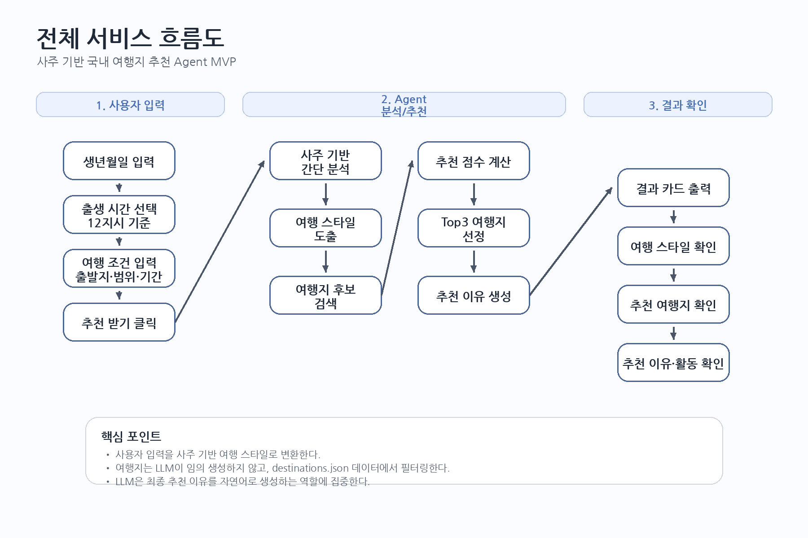
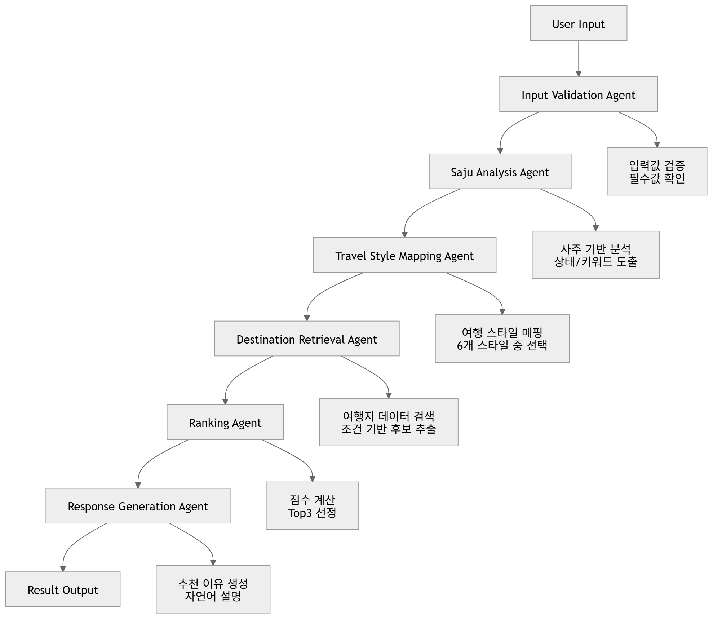
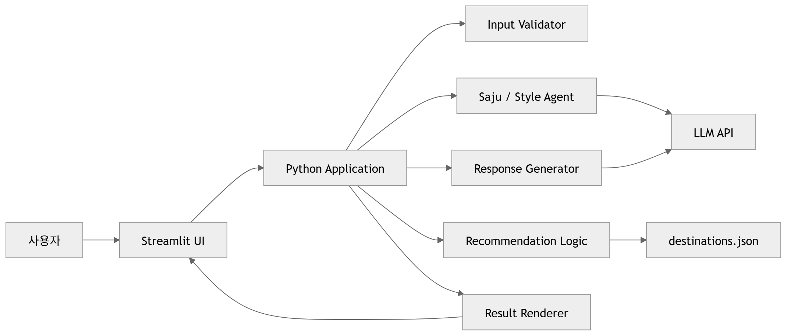

# 07. 도식도

# 사주 기반 국내 여행지 추천 Agent MVP 도식도

## 1. 문서 목적

이 문서는 사주 기반 국내 여행지 추천 Agent MVP의 주요 흐름을 시각적으로 정리하기 위한 문서입니다.

이번 프로젝트에서는 다음 3가지 도식도를 사용합니다.

1. 전체 서비스 흐름도
2. Agent Workflow 도식도
3. 시스템 구성도

각 도식도는 용도가 다릅니다.

| 도식도 | 목적 |
|---|---|
| 전체 서비스 흐름도 | 사용자가 서비스를 어떻게 사용하는지 설명 |
| Agent Workflow 도식도 | Agentic AI 구조와 단계별 역할 설명 |
| 시스템 구성도 | Streamlit, Python, LLM API, 여행지 데이터의 관계 설명 |

---

## 2. 전체 서비스 흐름도

### 2.1 설명

전체 서비스 흐름도는 사용자 관점에서 서비스가 어떻게 동작하는지 보여줍니다.

사용자는 생년월일시와 여행 조건을 입력합니다.

시스템은 입력값을 바탕으로 사주 기반 간단 분석을 수행하고, 이를 여행 스타일로 변환합니다.

이후 여행지 데이터에서 조건에 맞는 후보를 찾고, 추천 점수 기준에 따라 Top3 여행지를 선정합니다.

최종적으로 LLM이 추천 이유를 생성하고, 결과를 카드 형태로 출력합니다.

### 2.2 흐름 요약

1. 사용자가 생년월일을 입력한다.
2. 출생 시간을 만세력 기준 12지시로 선택한다.
3. 출발 지역, 이동 가능 범위, 여행 기간, 선호 태그를 입력한다.
4. 추천 받기 버튼을 클릭한다.
5. 시스템이 사주 기반 간단 분석을 수행한다.
6. 분석 결과를 여행 스타일로 변환한다.
7. 여행지 데이터에서 후보를 검색한다.
8. 추천 점수를 계산한다.
9. Top3 여행지를 선정한다.
10. LLM이 추천 이유를 생성한다.
11. 결과 카드가 화면에 출력된다.

---

## 3. Agent Workflow 도식도

### 3.1 설명

Agent Workflow 도식도는 이번 프로젝트의 핵심 구조를 보여줍니다.

이번 프로젝트는 LLM에게 한 번에 여행지를 추천받는 구조가 아닙니다.

입력값 검증, 사주 분석, 여행 스타일 매핑, 여행지 검색, 랭킹, 추천 이유 생성 단계를 나누어 처리합니다.

이를 통해 LLM이 모든 판단을 임의로 수행하지 않도록 하고, 추천 기준을 데이터와 코드 로직으로 제어합니다.

### 3.2 Agent 역할 요약

| Agent | 역할 |
|---|---|
| Input Validation Agent | 사용자 입력값 검증 및 정규화 |
| Saju Analysis Agent | 생년월일시 기반으로 현재 상태 또는 필요한 기운 분석 |
| Travel Style Mapping Agent | 분석 결과를 여행 스타일 키워드로 변환 |
| Destination Retrieval Agent | 여행지 데이터에서 조건에 맞는 후보 검색 |
| Ranking Agent | 추천 점수 기준으로 Top3 선정 |
| Response Generation Agent | 최종 추천 이유를 자연어로 생성 |

### 3.3 발표 설명 포인트

이 프로젝트는 LLM에게 한 번에 여행지를 추천받지 않았습니다.

입력 검증, 사주 분석, 여행 스타일 매핑, 여행지 검색, 랭킹, 응답 생성으로 역할을 나누었습니다.

LLM은 사주 분석과 추천 이유 생성처럼 자연어 해석이 필요한 부분에 사용하고, 여행지 검색과 Top3 선정은 데이터와 코드 로직으로 처리합니다.

---

## 4. 시스템 구성도

### 4.1 설명

시스템 구성도는 개발 관점에서 서비스가 어떤 구성 요소로 이루어져 있는지 보여줍니다.

사용자는 Streamlit UI를 통해 정보를 입력합니다.

Python Application은 입력값 검증, Agent Workflow 실행, 여행지 추천 로직, 결과 렌더링을 담당합니다.

LLM API는 사주 기반 간단 분석과 추천 이유 생성에 사용됩니다.

여행지 후보는 `destinations.json` 파일에서 가져옵니다.

### 4.2 구성 요소 설명

| 구성 요소 | 역할 |
|---|---|
| 사용자 | 생년월일시와 여행 조건 입력 |
| Streamlit UI | 입력 폼과 결과 카드 화면 제공 |
| Python Application | 전체 Workflow 실행 |
| Input Validator | 입력값 검증 |
| Saju / Style Agent | 사주 분석 및 여행 스타일 매핑 |
| Recommendation Logic | 여행지 필터링, 점수 계산, Top3 선정 |
| Response Generator | 추천 이유 생성 |
| LLM API | 사주 분석, 스타일 설명, 추천 이유 생성에 활용 |
| destinations.json | 여행지 데이터 저장 |
| Result Renderer | 추천 결과를 화면에 출력 |

---

## 5. 도식도별 사용 위치

| 도식도 | 사용 위치 |
|---|---|
| 전체 서비스 흐름도 | 프로젝트 기획서, 발표 초반 |
| Agent Workflow 도식도 | 발표 핵심 파트, 코치 피드백 대응 |
| 시스템 구성도 | 개발 설명, 기술 구현 설명 |

---

## 6. 최종 발표에서 사용할 우선순위

최종 발표 시간이 부족하다면 아래 순서로 사용합니다.

1. Agent Workflow 도식도
2. 전체 서비스 흐름도
3. 시스템 구성도

가장 중요한 것은 Agent Workflow 도식도입니다.

이번 프로젝트가 Agentic AI 기반 프로젝트라는 점을 보여주기 위해, 단순 LLM 호출이 아니라 단계별 Agent 구조를 사용했다는 점을 이 도식도로 설명합니다.

---

## 7. 발표 멘트 예시

### 7.1 전체 서비스 흐름도 설명

사용자는 생년월일시와 여행 조건을 입력합니다.

시스템은 이를 바탕으로 사주 기반 간단 분석을 수행하고, 여행 스타일을 도출합니다.

이후 여행지 데이터에서 조건에 맞는 후보를 찾고, 점수 기준으로 Top3 여행지를 추천합니다.

### 7.2 Agent Workflow 설명

저희는 LLM에게 한 번에 여행지를 추천받지 않았습니다.

입력값 검증, 사주 분석, 여행 스타일 매핑, 여행지 검색, 랭킹, 추천 이유 생성을 각각의 단계로 분리했습니다.

이를 통해 추천 기준을 명확히 하고, LLM이 임의로 여행지를 만들어내는 문제를 줄였습니다.

### 7.3 시스템 구성도 설명

화면은 Streamlit으로 구성하고, 전체 추천 흐름은 Python Application에서 처리합니다.

여행지 후보는 `destinations.json`에서 가져오고, LLM API는 사주 분석과 추천 이유 생성에 사용합니다.

---

## 8. 요약

이번 프로젝트에서 사용하는 도식도는 세 가지입니다.

1. 전체 서비스 흐름도
2. Agent Workflow 도식도
3. 시스템 구성도

전체 서비스 흐름도는 사용자 관점의 흐름을 설명합니다.

Agent Workflow 도식도는 이번 프로젝트의 핵심인 Agentic AI 구조를 설명합니다.

시스템 구성도는 Streamlit, Python Application, LLM API, 여행지 데이터의 관계를 설명합니다.

최종 발표에서는 Agent Workflow 도식도를 가장 중요하게 사용합니다.